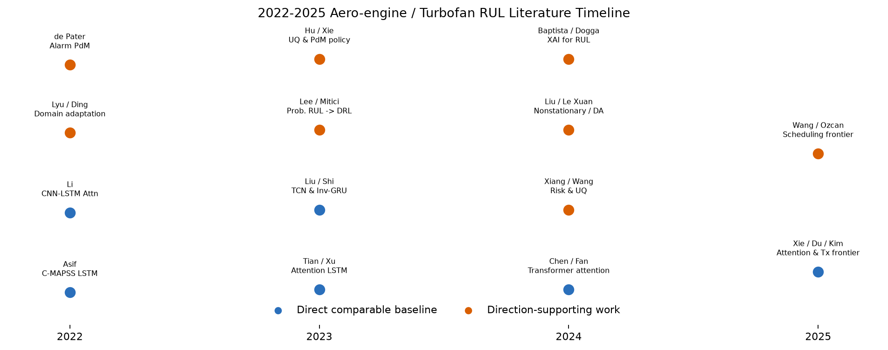
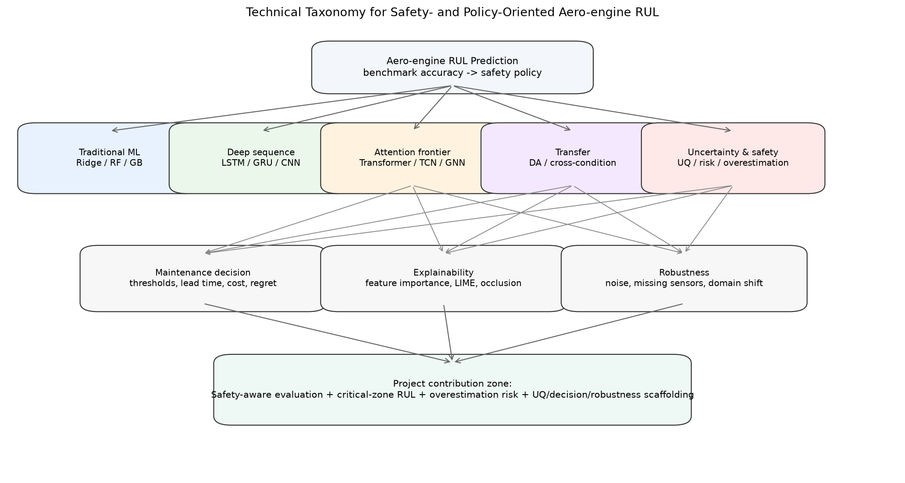
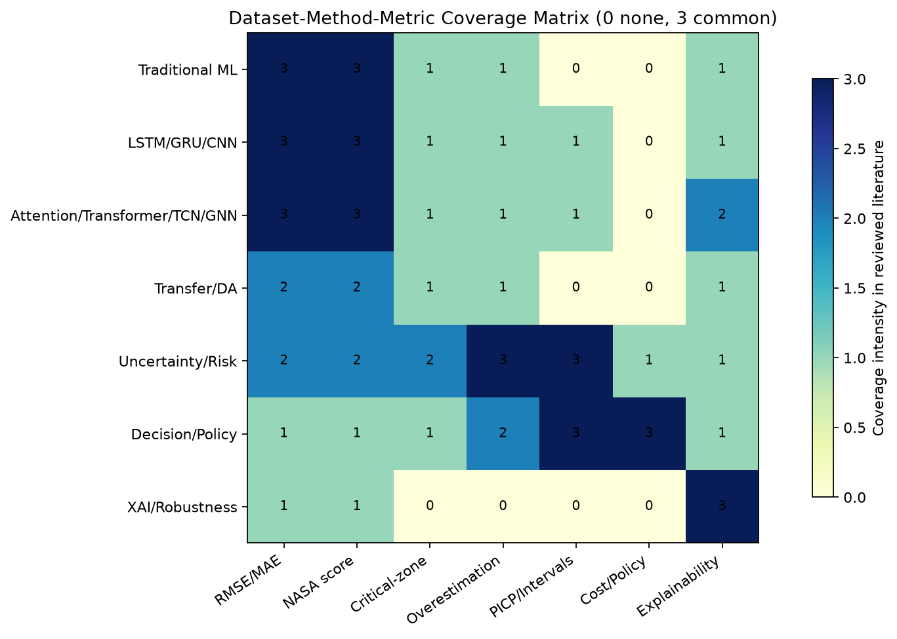
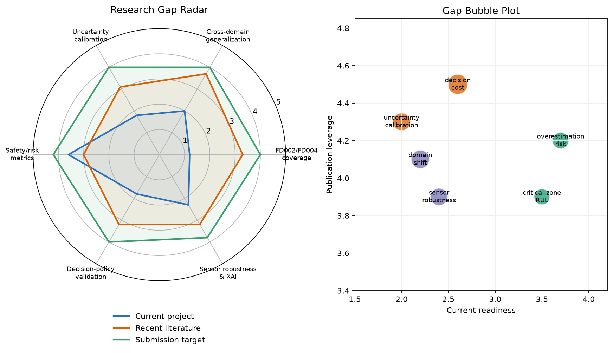
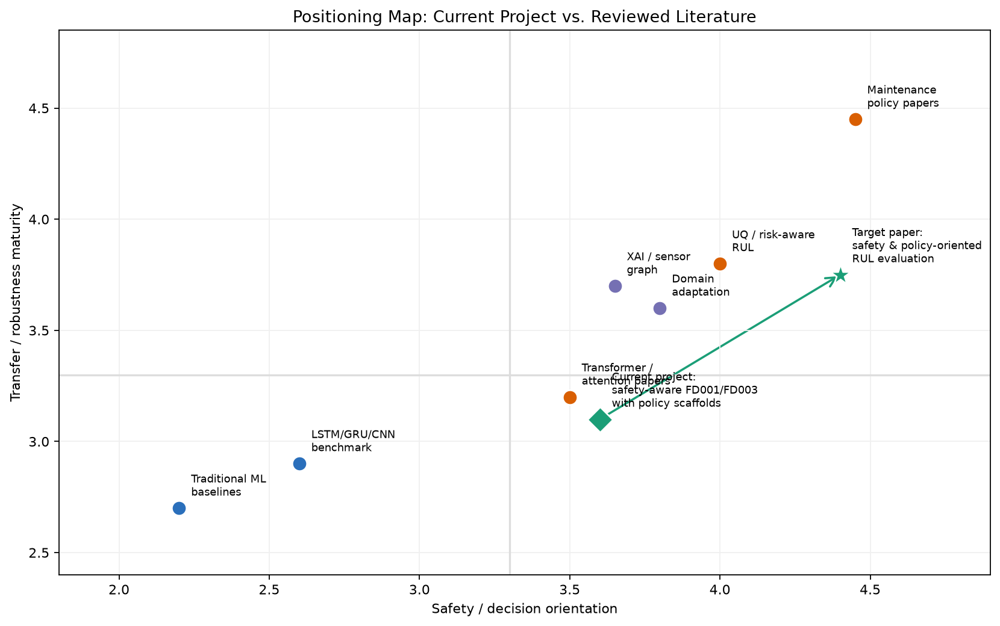

# 深度学习与机器学习技术在航空发动机健康管理与剩余寿命预测中的应用现状：从 C-MAPSS benchmark 到安全导向、迁移泛化、不确定性与维护决策

## English Abstract

Remaining useful life (RUL) prediction for aero-engines is a central task in prognostics and health management (PHM), but the field is moving beyond aggregate benchmark accuracy. This review synthesizes verified literature from 2022-2025, with selected foundational work on C-MAPSS, N-CMAPSS, CNN/LSTM baselines, domain adaptation, uncertainty quantification, and predictive maintenance. The evidence shows that C-MAPSS remains the dominant comparable benchmark, while recent methods increasingly use attention, Transformer, temporal convolution, graph fusion, Bayesian learning, and maintenance-policy optimization. However, most studies still emphasize RMSE and the NASA score, and comparatively fewer papers evaluate critical-zone RUL, optimistic overestimation risk, calibrated uncertainty, sensor robustness, cross-condition generalization, or downstream maintenance cost. Based on the current `D:\Project\Cmaps_RULE` project, this review positions the work as a Safety- and Policy-Oriented Aero-Engine RUL Prediction scaffold: a reproducible FD001/FD003 benchmark with Ridge, Random Forest, Gradient Boosting, LSTM, GRU, CNN, safety-aware GRU, and prototype modules for uncertainty, decision simulation, sensor robustness, and domain shift. The most promising publishable contributions are not another generic deep architecture, but safety-aware evaluation, critical-zone RUL behavior, overestimation risk, uncertainty calibration, maintenance decision cost, and robustness diagnostics.

**Keywords:** aero-engine remaining useful life; turbofan engine; C-MAPSS; PHM; safety-aware evaluation; uncertainty quantification; domain adaptation; predictive maintenance

## 中文摘要

航空发动机剩余寿命预测是 PHM 的核心任务之一。2022-2025 年的相关研究仍大量围绕 NASA C-MAPSS benchmark 展开，但技术重点已经从单纯比较 LSTM、CNN 或 Transformer 的 RMSE，逐渐转向多源迁移、跨工况泛化、概率预测、不确定性量化、可解释性与维护决策。本文基于 Crossref、OpenAlex、DOI 与出版社页面核验，整理了 51 条文献矩阵，区分“直接可比 baseline 文献”和“方向支撑文献”。综述显示，传统机器学习与特征工程仍是强 baseline；LSTM/GRU/CNN 构成 C-MAPSS 的基本深度序列模型谱系；Attention、Transformer、TCN 与 GNN 代表当前结构创新；domain adaptation 解决 FD002/FD004 与跨工况问题；uncertainty/risk-aware 方法开始回应点预测不足；而维护决策研究把 RUL 从模型指标转化为检修策略与成本问题。对当前 `D:\Project\Cmaps_RULE` 项目而言，已有 FD001/FD003 三 seed 主矩阵、focused GRU ablation、critical-zone RMSE、NASA score、overestimation ratio 和 safety-aware GRU 结果，可支撑一篇 safety-aware benchmark 短文雏形；uncertainty、decision simulation、sensor robustness 与 domain shift 模块已有代码和 smoke 输出，但尚不足以作为正式结论。本文建议将项目升级为“Safety- and Policy-Oriented Aero-Engine RUL Prediction”，核心切入点应围绕 critical-zone RUL、optimistic overestimation risk、uncertainty calibration、maintenance decision cost 与 sensor robustness，而不是声称提出新的通用 SOTA 架构。

## Introduction

Remaining useful life (RUL) prediction 的目标是估计设备距离失效还剩多少时间或循环数。在航空发动机场景中，RUL 不只是一个时间序列回归问题，还连接着维护窗口、备件安排、飞行安全裕度与运营成本。经典 PHM 文献已经把 diagnostics、prognostics 与 condition-based maintenance 视为连续决策链条，而非孤立预测任务 [Jardine et al., 2006](https://doi.org/10.1016/j.ymssp.2005.09.012)。NASA C-MAPSS 的提出使航空发动机 run-to-failure 模拟数据成为可复现实验平台 [Saxena et al., 2008](https://doi.org/10.1109/PHM.2008.4711414)，随后大量论文以 FD001-FD004 为标准 benchmark，报告 RMSE 与 NASA scoring function。

但是，C-MAPSS 研究已经进入拥挤阶段。单纯把 LSTM、CNN、GRU 或 Transformer 放到 FD001 上比较 RMSE，很难构成新的论文贡献。2022 年 Asif 等在 IEEE Access 中系统讨论了 C-MAPSS FD001-FD004 上的预处理、传感器选择、piecewise RUL label 与 LSTM 模型 [Asif et al., 2022](https://doi.org/10.1109/ACCESS.2022.3203406)。此后，Measurement、Sensors、Aerospace、Scientific Reports、Expert Systems with Applications 等期刊持续发表 attention-LSTM、SAE-TCN、Inv-GRU、hierarchical Transformer、Bayesian gated Transformer 等方法。结构创新仍活跃，但也带来一个问题：如果每篇论文只报告平均 RMSE/score，读者很难判断模型是否真的更适合安全敏感的维护场景。

航空发动机 RUL 的误差具有方向性。预测过低会导致提前维护和成本损失；预测过高则可能延误检修，风险更高。NASA score 已经隐含这种非对称惩罚，但许多研究仍把它作为附属指标，而不是围绕 overestimation risk、critical-zone RUL 或 maintenance policy 组织实验。Lee 与 Mitici 的 probabilistic RUL + deep reinforcement learning 维护决策研究 [Lee & Mitici, 2023](https://doi.org/10.1016/j.ress.2022.108908)，以及 alarm-based aircraft-engine scheduling 工作 [de Pater et al., 2022](https://doi.org/10.1016/j.ress.2022.108341)，说明预测结果最终应进入维护策略，而非停留在单点误差表格。

因此，本文的综述问题不是“哪一种深度网络在 C-MAPSS 上最低 RMSE”，而是：2022-2025 年 aero-engine/turbofan RUL 文献如何从 benchmark accuracy 走向 safety-aware、transfer-generalizable、uncertainty-calibrated、decision-oriented evaluation？在这一图景下，当前 `D:\Project\Cmaps_RULE` 项目应如何升级为可投稿的论文雏形？

本文使用的正式参考文献均有 DOI、出版社页面、arXiv 或官方链接；不能确认的候选不进入 References。完整文献矩阵见 [`literature_matrix.csv`](literature_matrix.csv)，BibTeX 见 [`references.bib`](references.bib)。图 1-5 分别给出 2022-2025 timeline、技术 taxonomy、数据集-方法-指标热图、研究缺口 radar/bubble plot 和项目 positioning map。

从研究范式看，当前 aero-engine RUL 文献至少有三种不同目标。第一种是 **benchmark competition**：在固定 C-MAPSS split 与固定评价指标下追求更低 RMSE 或 NASA score。第二种是 **robust prognostics**：关心模型在跨工况、跨故障、传感器扰动、样本不足或目标域无标签时是否仍可用。第三种是 **decision-oriented PHM**：把 RUL 预测视为维护决策链条中的输入，要求模型输出能被风险、成本、提前量和不确定性解释。许多论文在题目中都使用“aero-engine RUL prediction”，但实际贡献可能属于完全不同层级。如果不区分这三种目标，就容易把一个更复杂的 Transformer 模型误认为自动更适合工程维护，或把一个低 RMSE 模型误认为安全风险更低。本文的立场是：C-MAPSS 仍然适合做可复现 benchmark，但若目标是投稿到 safety- and policy-oriented RUL 方向，就必须显式说明模型预测如何进入 late-life risk、uncertainty calibration 与 maintenance cost 评价。

这也解释了为什么本文不把“最新”简单等同于“最重要”。2025 年的多头注意力、Koopman Transformer、spatial-temporal feature fusion 等工作能代表结构前沿，但对你的项目来说，直接价值未必高于 Asif 2022、Xiang 2024、Lee & Mitici 2023 或 de Pater 2022。前者告诉我们模型复杂度在哪里发展，后者告诉我们论文应该如何从预处理、风险、不确定性与决策边界形成清晰贡献。换言之，你当前项目的优势不在于追赶最大模型，而在于把已有模型谱系放入更严格、更接近 PHM 决策需求的评价框架。

## Datasets and Benchmark Protocols

C-MAPSS 是航空发动机 RUL 研究中最常用的 benchmark。其数据来自涡扇发动机退化仿真，包含 engine unit、cycle、operational settings 与 sensor channels。FD001 是单工况、单故障；FD002 是多工况、单故障；FD003 是单工况、多故障；FD004 是多工况、多故障。Saxena 等的 PHM 2008 论文奠定了 aircraft engine run-to-failure simulation 的基本数据来源 [Saxena et al., 2008](https://doi.org/10.1109/PHM.2008.4711414)。NASA PCoE 官方 repository 是数据源边界，不能把 C-MAPSS 说成真实机队遥测数据。

Benchmark protocol 的关键不是“读取数据后训练模型”这么简单。C-MAPSS 很容易发生数据泄漏：如果按窗口随机划分训练/验证集，同一台发动机不同 cycle 的窗口可能同时出现在 train 和 validation；如果 scaler 在全数据上 fit，也会泄漏 test distribution；如果 test trajectory 每个窗口都参与测试，而不是每台 test engine 只取最后窗口，就会偏离官方 RUL 文件的使用方式。因此，近年来有价值的 C-MAPSS 论文不只是换模型，还会讨论 RUL cap、piecewise labels、sensor filtering、operating-condition normalization、sliding-window length 与 validation split。

N-CMAPSS 是更现实的后续数据集，基于真实飞行 profiles 与更细致的 operation history，为 C-MAPSS 到真实工况提供桥梁 [Arias Chao et al., 2021](https://doi.org/10.3390/data6010005)。但 N-CMAPSS 不是当前项目已经完成的实验对象。对 `D:\Project\Cmaps_RULE` 而言，现阶段本地数据包括 FD001 与 FD003，尚未见 FD002/FD004。综述与论文定位必须明确：FD001/FD003 结果只证明单工况条件下的可复现 benchmark 行为，不能推断多工况、多故障、真实飞行 profile 或真实 maintenance policy 的有效性。

在论文写作中，dataset protocol 应该被当作方法贡献的一部分。许多初学者会把 C-MAPSS 当作“已经标准化”的数据集，从而忽略了 RUL label cap、window length、train/validation engine split、sensor selection、operating condition normalization、test last-window rule 等选择。实际上，这些选择可以显著改变结果，并且会影响模型之间的公平性。例如，特征工程树模型通常从窗口统计量中获得平滑趋势信息，而 recurrent model 直接处理多变量时序；如果不说明这种输入差异，读者会误以为比较的是“模型架构本身”，而不是“完整预测管线”。因此，当前项目若要投稿，方法部分必须把 preprocessing 和 evaluation protocol 写得比普通课程报告更详细：哪些列被删除、scaler 如何 fit、validation engine 如何划分、RUL cap 是否对 train/test 一致、是否每台 test engine 只取最后窗口、是否所有模型使用同一随机种子集合。

另一个需要强调的是 FD001/FD003 的选择逻辑。FD001 与 FD003 都是单工况，因此它们适合比较 fault-mode complexity 对模型的影响；FD003 相比 FD001 增加故障模式，但没有引入多工况归一化难题。这对初稿很有价值，因为可以把问题聚焦在“强 baseline 下 safety metrics 如何改变排序”。但如果论文标题或摘要暗示“aero-engine RUL across operating conditions”，审稿人会立刻要求 FD002/FD004 或 N-CMAPSS。因此，当前标题中可以保留 “C-MAPSS FD001/FD003” 或 “single-operating-condition subsets”，用边界换取可信度。

## Traditional Machine Learning for Aero-engine RUL

传统机器学习并未过时。C-MAPSS 的数据规模相对有限，且退化趋势可通过窗口统计特征表达，因此 Ridge、Random Forest、Gradient Boosting、XGBoost 等方法仍可成为强 baseline。与深度模型相比，传统 ML 的优势在于训练稳定、数据需求较低、解释性较强、计算预算透明。其劣势是依赖人工特征，难以直接学习长时序依赖和多传感器复杂交互。

当前项目中的 `train_ml.py` 与 `features.py` 使用 window mean、std、last value、delta、slope 等统计特征训练 Ridge、Random Forest 与 Gradient Boosting。这一设定适合作为“工程 pipeline 比较”，而不是纯 architecture 比较：传统模型得到的是 handcrafted summary，深度模型得到的是 raw sequence window。项目已有结果显示，在 FD001 上 Gradient Boosting 的 RMSE 为 `12.81 ± 0.38`，Random Forest 为 `13.01 ± 0.57`，均强于普通 GRU/LSTM。这个事实很重要：论文不应写成“深度学习天然优于传统机器学习”，而应写成“在强传统 baseline 下，哪些 safety-oriented 指标会改变模型排序”。

传统 ML 文献在 2022-2025 的 aero-engine RUL 中常作为比较对象，而不是研究主角。Madjour 等 2023 年比较 deep learning 与 decision tree approaches，用于 aircraft engine RUL [Madjour et al., 2023](https://doi.org/10.2478/fas-2023-0012)，说明决策树类方法仍被纳入最近 benchmark。对于投稿短文，强传统 baseline 是可信度来源：如果只比较 LSTM、GRU、CNN，审稿人会质疑是否避开了更强、更简单的 tabular baselines。

传统 ML 的另一项价值是作为误差诊断的参照系。树模型若在 FD001 上表现强，说明简单单工况、单故障场景中的退化信息可能已经被均值、斜率和末值等低阶统计量捕获；深度模型若不能超过它们，就不应把失败解释为“训练不够久”或“数据太复杂”。相反，应该进一步分析：深度模型是否在 late-life critical zone 更保守？是否减少 overestimation？是否对传感器缺失更稳定？是否能提供更合理的不确定性？如果答案是否定的，传统 ML baseline 就是更优工程选择。这样的写法比单纯追逐 SOTA 更诚实，也更符合 PHM 审稿人的期待。

从 safety-oriented 角度看，传统 ML 还有一个常被忽略的优势：它们的误差分布可能更容易被校准和解释。Random Forest 可以通过 ensemble variance 或 bootstrap 获得近似不确定性，Gradient Boosting 可扩展到 quantile loss，Ridge 可作为低方差线性基线。当前项目未来做 UQ 时，不应只给 GRU 做 MC Dropout，也应考虑给树模型建立 bootstrap/quantile baseline。否则若 deep UQ 表现不好，审稿人会问：为什么不用更简单的 ensemble baseline？

## Deep Sequence Models

深度序列模型是 C-MAPSS RUL 研究的基本谱系。Babu 等用 deep CNN 做 RUL regression [Babu et al., 2016](https://doi.org/10.1007/978-3-319-32025-0_14)，Zheng 等用 LSTM 建立经典 recurrent baseline [Zheng et al., 2017](https://doi.org/10.1109/ICPHM.2017.7998311)，Li、Ding 与 Sun 在 RESS 中提出 deep convolution neural network 方案 [Li et al., 2018](https://doi.org/10.1016/j.ress.2017.11.021)。这些 foundational works 仍是 C-MAPSS 论文的直接对照。

2022 年后，LSTM/CNN 系列继续演化。Asif 等的 IEEE Access 论文强调 C-MAPSS FD001-FD004 上的 preprocessing、improved piecewise RUL 与 LSTM [Asif et al., 2022](https://doi.org/10.1109/ACCESS.2022.3203406)。Li、Wang 与 Li 的 PeerJ Computer Science 论文将 CNN-LSTM 与 CBAM attention 结合 [Li et al., 2022](https://doi.org/10.7717/peerj-cs.1084)。Shi 等在 Sensors 提出 Inv-GRU，用 lightweight adaptive spatiotemporal information extraction operator 改造 GRU [Shi et al., 2023](https://doi.org/10.3390/s23136163)。

更直接的 recurrent baseline 还包括 Thakkar 与 Chaoui 2022 年在 Actuators 发表的 deep layer recurrent neural networks，用于 aircraft turbofan engine RUL [Thakkar & Chaoui, 2022](https://doi.org/10.3390/act11030067)，以及 Zhang 等 2022 年在 RESS 发表的 BiGRU with temporal self-attention [Zhang et al., 2022](https://doi.org/10.1016/j.ress.2021.108297)。这些论文说明 GRU/LSTM 的研究重点已经不只是“是否使用循环网络”，而是如何加入注意力、双向上下文、深层 recurrent stacking、RUL label strategy 与特征选择。Wang 等 2023 年以 Random Forest feature selection + MLP 覆盖 C-MAPSS FD001-FD004 [Wang et al., 2023](https://doi.org/10.3390/app13127186)，也提醒我们传统 ML 不只可以作为最终预测器，还可以作为 sensor screening 或 feature selection 的前端模块。

对当前项目而言，LSTM/GRU/CNN 已经实现，且有 FD001/FD003 三 seed 主矩阵。普通 GRU 在 FD001 上 RMSE `15.27 ± 0.64`，LSTM 为 `15.60 ± 0.51`，1D-CNN 为 `22.47 ± 1.17`；FD003 上普通 GRU 为 `15.24 ± 1.45`，LSTM 为 `14.41 ± 1.57`，1D-CNN 为 `23.76 ± 0.42`。这些结果说明本地 compact CNN 配置较弱，但不能推出 CNN 方法一般无效，因为 Babu 2016、Li 2018 与 Shen 2025 的 1D-CNN/GWO-1DCNN 研究均表明更强 CNN 设计可能有效 [Shen et al., 2025](https://doi.org/10.3390/machines13070583)。论文应把 CNN failure 写成“tested configuration 下的负结果”，而非模型家族判决。

深度序列模型的关键问题是“时序窗口到底提供了什么”。在 C-MAPSS 中，早期 RUL 常被 cap 到固定上限，退化信号在 early-life 不明显；模型如果把大量 early-life plateau 当成主要训练对象，可能学到平均化预测，而不是 failure-proximal behavior。GRU/LSTM 的优势应体现在时间依赖和趋势变化，而不是在所有区间平均误差都更小。当前项目中 FD003 `GRU window50` 数值上优于 Gradient Boosting，但 paired bootstrap 区间跨 0，说明不能声称显著胜出。这种谨慎反而能增强论文可信度：它承认深度模型优势是条件性的，可能与 fault-mode heterogeneity、窗口长度和 safety metric 有关，而非普遍规律。

如果继续扩展深度模型，建议优先做 controlled ablation，而不是直接加入复杂架构。窗口长度、hidden size、层数、dropout、learning-rate scheduler、RUL cap、critical threshold、loss weight 都应逐项控制。这样即便最终没有显著提升，也能形成有价值的 negative/diagnostic paper。相比之下，如果同时更换 Transformer、attention、normalization、loss 与训练预算，审稿人很难判断性能变化来自哪里。

## Attention, Transformer, TCN and Graph Models

2022-2025 年的主要结构创新集中在 attention、Transformer、TCN、spatio-temporal fusion 与 graph modeling。Tian、Yang 与 Ju 在 Measurement 提出 spatial correlation and temporal attention-based LSTM [Tian et al., 2023](https://doi.org/10.1016/j.measurement.2023.112816)。Xu 等在 Measurement 讨论 global attention mechanism for aero-engine RUL [Xu et al., 2023](https://doi.org/10.1016/j.measurement.2023.113098)。Liu 等在 Aerospace 提出 SAE-TCN，用 autoencoder 降维并用 temporal convolutional network 预测 turbofan RUL [Liu et al., 2023](https://doi.org/10.3390/aerospace10080715)。

Transformer 在 2024 年后尤其活跃。Chen 的 Scientific Reports 论文提出 position-sensitive attention 与 gated hierarchical LSTM 增强的 Transformer-based DL model [Chen, 2024](https://doi.org/10.1038/s41598-024-59095-3)。Fan、Li 与 Chang 在 Sensors 提出 two-stage attention-based hierarchical Transformer，即 STAR framework，将 temporal attention 与 sensor-wise attention 分开处理 [Fan et al., 2024](https://doi.org/10.3390/s24030824)。Kim 等 2025 年在 IEEE Transactions on Instrumentation and Measurement 提出 spatiotemporal Koopman dual-branch Transformer [Kim et al., 2025](https://doi.org/10.1109/TIM.2025.3625335)。Xie 等 2025 年的 Applied Intelligence 论文提出 deep multi-scale multi-head attention network [Xie et al., 2025](https://doi.org/10.1007/s10489-025-06705-w)，Du 等 2025 年在 ESWA 提出 STF2 spatial-temporal feature fusion [Du et al., 2025](https://doi.org/10.1016/j.eswa.2025.128370)。

GNN 或 sensor graph 方向则关注传感器之间的空间相关性。Zhang 等的 IEEE Sensors Journal 论文 Adaptive Spatio-Temporal Graph Information Fusion for RUL Prediction 说明 sensor relation 本身可能是 RUL 信号的一部分 [Zhang et al., 2022](https://doi.org/10.1109/JSEN.2021.3136622)。这对当前项目有两个启示：第一，sensor robustness 不应只是随机加噪，还应区分重要传感器、冗余传感器和传感器关系；第二，feature importance 与 occlusion importance 可以成为轻量级 XAI baseline，为未来 sensor graph 模型提供解释坐标。

Attention 与 Transformer 文献的共同动机是：普通 RNN 可能难以同时捕获长程退化依赖、局部上下文和传感器维度交互。STAR 这类 hierarchical Transformer 明确区分 temporal attention 与 sensor-wise attention，说明仅在时间维度做 attention 可能不足。TCN 的优势则是并行卷积和扩张感受野，可能比 RNN 更稳定地处理长窗口。Graph 方法进一步把传感器关系显式化，使模型不只是“把每个传感器当作一列输入”，而是学习 sensor topology 或动态相关性。

2022 年后的 Transformer/GNN 直接 baseline 还包括 dual-aspect self-attention Transformer [Zhang et al., 2022](https://doi.org/10.1109/TIM.2022.3160561)、gated graph convolutional network with multi-sensor signals [Wang et al., 2022](https://doi.org/10.1016/j.knosys.2022.109340)、trend-augmented and temporal-featured Transformer [Zhang et al., 2024](https://doi.org/10.1016/j.ress.2023.109662)、adaptive GCN enhanced Transformer encoder [Ma et al., 2024](https://doi.org/10.3390/aerospace11040289)，以及 MST-GAT multi-perspective spatial-temporal graph attention network [Zhou & Wang, 2024](https://doi.org/10.1016/j.inffus.2024.102462)。其中 Ma 2024 与 Wang 2023 的 scout 结果显示其覆盖 FD001-FD004，因此特别适合未来补齐 FD002/FD004 后作为直接对照。Zhou 等 2023 年把 C-MAPSS 与 N-CMAPSS 纳入 multi-task prognosis strategy，把 RUL 与 fault diagnosis 放入多任务框架 [Zhou et al., 2023](https://doi.org/10.1016/j.ress.2023.109182)，这也为 FD003/FD004 的多故障讨论提供了方向。

但是，结构前沿也带来复现风险。许多论文会同时引入复杂模块、复杂调参和多个消融项，若没有开源代码和统一 protocol，很难判断提升是否来自结构本身、训练预算、数据预处理或指标选择。因此，当前项目不宜把“加入 Transformer”作为首要投稿策略。更稳妥的路线是：先用现有 LSTM/GRU/CNN/ML baseline 建立严格评价，再把 Transformer/TCN/GNN 作为 future comparator。若一定要加入一个现代 baseline，建议选择相对容易复现的 TCN 或轻量 attention-GRU，而不是一次性实现复杂 dual-branch Transformer。

## Transfer Learning and Domain Shift

跨工况泛化是 C-MAPSS 研究中最容易被低估的问题。FD001/FD003 都是 single operating condition，而 FD002/FD004 才是 multi-condition。一个模型在 FD001 上表现好，并不意味着能处理 operating setting 分布变化或 fault-mode 组合变化。Da Costa 等在 RESS 中提出 deep domain adaptation for RUL，是这一方向的 foundational anchor [da Costa et al., 2020](https://doi.org/10.1016/j.ress.2019.106682)。Lyu 等 2022 年提出 LSTM-MRAN，通过 multi-representation domain adaptation 对齐源域与目标域 [Lyu et al., 2022](https://doi.org/10.3390/math10244647)。

2022 年 Ding 等在 IEEE/ASME Transactions on Mechatronics 中讨论 multisource domain adaptation for RUL across operating conditions，虽然其验证对象不是 aero-engine，而是 machinery/bearing 类 run-to-failure 数据，但方法论对 FD001/FD002/FD003/FD004 多源迁移有启发 [Ding et al., 2022](https://doi.org/10.1109/TMECH.2022.3147534)。Le Xuan、Munderloh 与 Ostermann 2024 年在 RESS 提出 self-supervised domain adaptation for machinery RUL，说明仅做 invariant feature alignment 可能不足，需要利用 target-domain self-supervised signals [Le Xuan et al., 2024](https://doi.org/10.1016/j.ress.2024.110296)。Liu 等 2024 年 Measurement 论文直接面向 multiple operating conditions 下的 non-stationary feature learning [Liu et al., 2024](https://doi.org/10.1016/j.measurement.2024.114242)。

当前项目已有 `domain_shift.py` 与 `run_domain_shift.py`，可做 FD source-to-target stress test。根据 scout 扫描，这一模块目前属于 prototype：有代码和 smoke 输出，但尚无系统三 seed、多模型、多方向迁移结论。因此，正文不应声称“实现 domain adaptation”，而应写成“已经实现 domain-shift evaluation scaffold，下一步可加入 DANN、MRAN、self-supervised DA 或 multisource DA”。这一区分很关键：domain shift stress test 是评价，domain adaptation 是训练策略，两者不能混用。

迁移泛化还涉及一个更深的问题：source 与 target 的标签可用性。若使用 target labels 做验证或调参，就不再是无监督 domain adaptation；若完全不使用 target labels，模型选择又会变得困难。C-MAPSS FD002/FD004 的多工况数据还要求 operating-condition normalization，否则模型可能学习 operating setting 差异而非退化规律。DANN、MRAN、self-supervised DA 等方法都有各自假设：DANN 通过 gradient reversal 学 domain-invariant features，MRAN 强调多表示空间对齐，self-supervised DA 则利用目标域内部结构。未来实验必须说明 target-domain 信息使用边界，否则很容易发生隐性泄漏。

对你的项目而言，一个可控的迁移实验可以分三层。第一层是 **stress test**：FD001 train → FD003 test，FD003 train → FD001 test，不做 adaptation，只报告性能下降。第二层是 **calibration under shift**：看 uncertainty 是否在 target domain 变大，是否与 error 相关。第三层才是 **adaptation**：加入无监督或少量标注 target 数据，并与 no-adaptation baseline 比较。这样可以形成清晰的研究递进，而不是把所有跨域问题混成一个笼统结论。

## Uncertainty, Risk and Safety-Aware Evaluation

不确定性量化正在成为 aero-engine RUL 的重要前沿。传统 C-MAPSS 论文输出单点 RUL，但维护决策需要知道模型是否可靠。Gal 与 Ghahramani 的 MC Dropout 提供了 dropout-as-Bayesian-approximation 的经典方法 [Gal & Ghahramani, 2016](https://proceedings.mlr.press/v48/gal16.html)，Lakshminarayanan、Pritzel 与 Blundell 的 deep ensembles 是另一个通用 UQ baseline [Lakshminarayanan et al., 2017](https://papers.nips.cc/paper_files/paper/2017/hash/9ef2ed4b7fd2c810847ffa5fa85bce38-Abstract.html)。

在 aero-engine RUL 领域，Xiang 等 2024 年 ESWA 论文 Bayesian gated-transformer model for risk-aware prediction of aero-engine RUL 直接把 Bayesian/Transformer 与 risk-aware prediction 结合 [Xiang et al., 2024](https://doi.org/10.1016/j.eswa.2023.121859)。Wang 等 2024 年 Processes 论文提出 integrating uncertainty quantification 的 parallel prognostic method，用于 probabilistic RUL [Wang et al., 2024](https://doi.org/10.3390/pr12122925)。Hu 等 2023 年 Applied Sciences 论文讨论 improved Bayesian uncertainty estimation 与 RUL probability prediction [Hu et al., 2023](https://doi.org/10.3390/app13169194)。这些工作说明，未来 RUL 模型应报告 PICP、MPIW、Winkler score、uncertainty-error correlation 或 calibration curve，而不是只报告 RMSE。

Safety-aware evaluation 则关注误差方向和 late-life 区域。NASA score 已经对 overestimation 更严，但还不够透明。当前项目已有 `critical_rmse_30`、`critical_rmse_50`、`overestimation_ratio`、`overestimation_magnitude` 等指标，并实现 `critical_mse`、`asymmetric_mse`、`safety_mse`。结果显示 FD001 上 Gradient Boosting 的 aggregate RMSE 最强，但 GRU safety-w2 的 critical RMSE50 最低；FD003 上 GRU window50 的 RMSE 最低，但 Random Forest critical RMSE50 最低，safety-aware GRU 的 overestimation ratio 最低。这正是 safety-aware 论文的核心：不同指标改变模型排序。

但要谨慎：当前 uncertainty 模块只有 smoke 级结果，scout 报告指出 uncertainty smoke RMSE `83.7`、PICP `0` 只能证明管线可跑，不能证明模型有可靠不确定性。因此，综述可以把 UQ 作为 future experimental plan，也可以在论文中作为 prototype appendix，但正式结论必须等多 seed、多模型、合理训练预算和 calibration plots 完成后再写。

风险导向评价还需要区分 **aleatoric uncertainty** 与 **epistemic uncertainty**。C-MAPSS 中的传感器噪声、故障模式差异和运行条件变化会造成数据固有不确定性；模型结构、训练样本不足和目标域偏移会造成认知不确定性。MC Dropout 和 deep ensembles 更常被用作 epistemic uncertainty 的近似，而 probabilistic output 或 mixture density 更适合表达预测分布。若未来论文只画一个 prediction interval，而不说明 interval 的含义，审稿人会质疑不确定性是否校准。更严谨的做法是同时报告 coverage、width 和 error correlation：区间覆盖率是否接近目标置信度，区间是否过宽，模型不确定时是否真的更容易出错。

Safety-aware loss 也应被解释为训练偏好，而不是安全保证。`safety_mse` 通过对 critical samples 和 overestimation errors 加权，引导模型减少 late-life 乐观误差；但如果权重过大，可能导致整体 RMSE 变差或过度保守。当前项目中 FD003 safety-w2 降低 overestimation ratio 但 RMSE 不占优，正好说明安全目标与平均精度存在 trade-off。论文应把这种 trade-off 画出来，而不是只挑一个指标宣布胜利。

## Maintenance Decision-Oriented RUL Prediction

维护决策是把 RUL 从 benchmark 指标推向工程价值的关键。Lee 与 Mitici 2023 年在 RESS 中把 probabilistic RUL prognostics 与 deep reinforcement learning predictive maintenance 结合 [Lee & Mitici, 2023](https://doi.org/10.1016/j.ress.2022.108908)。de Pater、Reijns 与 Mitici 2022 年研究 imperfect RUL prognostics 下的 alarm-based aircraft-engine maintenance scheduling [de Pater et al., 2022](https://doi.org/10.1016/j.ress.2022.108341)。Mitici 等 2023 年进一步讨论 multiple components 与 turbofan engines 的 dynamic predictive maintenance [Mitici et al., 2023](https://doi.org/10.1016/j.ress.2023.109199)。Wang、Chen、Zhao 与 Xiang 2024 年在 IEEE Internet of Things Journal 发表 aircraft-engine predictive maintenance scheduling based on RUL prediction [Wang et al., 2024](https://doi.org/10.1109/JIOT.2024.3376715)。2025 年，predictive maintenance programs、metaheuristic formulations 与 interpretable ensemble scheduling 继续扩展这一方向 [Xue et al., 2025](https://doi.org/10.1038/s41598-025-19957-w); [Wang et al., 2025](https://doi.org/10.1016/j.ress.2025.111064); [Ozcan, 2025](https://doi.org/10.1038/s41598-025-23473-2)。

这些研究的共同启示是：RUL 模型不能只问“预测误差多少”，还要问“用这个预测触发维护会怎样”。一个 RMSE 稍高但更保守的模型，可能降低 late maintenance；一个 RMSE 最低但过度乐观的模型，可能在高风险区间造成更高决策成本。因此，当前项目的 `decision.py` 与 `run_decision_simulation.py` 是非常有价值的升级方向。建议把 decision simulation 设计成明确的 cost model：late cost、early cost、inspection/maintenance cost、lead-time requirement、confidence-bound trigger。可比较 point trigger 与 lower-confidence-bound trigger，报告 total cost、late events、wasted life、regret。

不过，当前项目还不能把 decision simulation 写成真实 maintenance policy validation。C-MAPSS 是仿真 benchmark，没有真实机队维修记录、备件约束、航班排班、维修资源、监管限制。更合适的表述是：maintenance decision-oriented evaluation layer，或 policy simulation under benchmark-derived predictions。

维护决策层最容易犯的错误，是把预测指标和决策指标混为一谈。低 RMSE 模型可能在高 RUL 区间表现很好，但在 RUL 接近 0 时过度乐观；如果 maintenance trigger 恰好依赖低 RUL 阈值，这种模型的实际 late cost 会很高。相反，一个保守模型可能增加 early maintenance，但降低 catastrophic late decision。决策论文需要把这些成本显式化，而不能用“模型更准所以维护更好”这种线性推断。Lee & Mitici 类研究的重要性就在于，它们把 probabilistic prognostics 放进 policy/reward/cost 框架，使预测不确定性直接影响动作选择。

对当前项目，最小可行的 decision simulation 可以设计为四个策略：point estimate below threshold、mean minus one standard deviation、lower prediction interval bound、fixed conservative bias。每个策略报告 late events、early events、mean lead time、wasted life、total cost、critical-zone regret。这样即便没有真实维修数据，也能回答一个清楚问题：当模型存在不确定性和 overestimation risk 时，保守触发是否降低 benchmark-derived decision cost？这个问题比“哪个模型 RMSE 最低”更接近 Safety- and Policy-Oriented RUL 的论文题目。

## Explainability and Sensor Robustness

可解释性与传感器鲁棒性是航空发动机 RUL 的信任层。RUL 模型输入是多传感器时间序列，模型可能依赖少数传感器，也可能在传感器失效、噪声、masking 或 distribution shift 下崩溃。Protopapadakis 等在 ASME Turbo Expo 讨论 explainable/interpretable AI-assisted aeroengine RUL，强调严格安全标准下解释性的重要性 [Protopapadakis et al., 2022](https://doi.org/10.1115/GT2022-80777)。Dogga、Sathyan 与 Cohen 2024 年在 AIAA SciTech 讨论 aircraft-engine RUL 的 XAI [Dogga et al., 2024](https://doi.org/10.2514/6.2024-2530)。Baptista 等 2024 年 PHM Society 论文把 GRU RUL 与 LIME 解释结合 [Baptista et al., 2024](https://doi.org/10.36001/phmconf.2024.v16i1.4124)。Youness 与 Aalah 2023 年 Aerospace 论文也从 XAI 角度讨论 RUL [Youness & Aalah, 2023](https://doi.org/10.3390/aerospace10050474)。

当前项目已有 `xai.py`、`robustness.py`、`run_sensor_robustness.py`。更成熟的论文可以把传感器重要性与鲁棒性相连：先用 Random Forest feature importance、occlusion importance 或 LIME/SHAP 估计关键传感器，再分别进行 random mask、important-sensor mask、Gaussian noise、sensor dropout。指标不应只看 RMSE drop，还应看 critical-zone RMSE drop 与 overestimation ratio change。这样就能把 XAI 从“画一张解释图”升级为“解释是否预测了脆弱性”。

解释性分析还应避免“漂亮但无用”的陷阱。某个传感器 importance 高，并不自动意味着模型可靠；也不意味着该传感器在物理上一定是故障原因。XAI 在 C-MAPSS 中更适合做模型诊断：模型是否过度依赖少数传感器？这些传感器被加噪或 mask 后，错误是否显著上升？不同 seed 的重要性排序是否稳定？深度模型与树模型是否依赖相同传感器？如果这些问题能被回答，XAI 就能服务于 robustness 和 safety evaluation，而不仅是论文中的装饰图。

传感器鲁棒性还可以与 domain shift 连接。跨 FD subset 失败可能来自故障模式差异，也可能来自传感器分布变化。若某些传感器在 FD001 中重要、在 FD003 中不稳定，模型迁移时就可能出现 overestimation。未来可以把 sensor distribution shift、feature importance shift 与 RUL error shift 放在同一张图中，这会比单独报告一个 source-target RMSE 更有解释力。

## Research Gaps

第一，C-MAPSS 文献仍偏向 aggregate point-prediction metrics。RMSE、MAE 与 NASA score 必要但不足。Critical-zone RUL、overestimation magnitude、late-life calibration、prediction interval coverage 与 maintenance regret 仍未成为标准报告组合。

第二，许多 attention/Transformer 论文提升结构复杂度，但对公平 baseline、训练预算、统计显著性、跨 subset 泛化和 negative results 讨论不足。对学生项目而言，若直接追逐 Transformer SOTA，容易陷入“更复杂但不一定更可信”的路线。

第三，domain shift 与 domain adaptation 常被混在一起。跨 FD subset 测试可暴露泛化问题，但不等于模型学会了域适应。真正的 domain adaptation 需要明确 source/target、是否无监督、是否使用 target labels、alignment loss、target validation 规则和 leakage 控制。

第四，不确定性研究正在增加，但 calibration quality 的报告仍不稳定。PICP 高不代表好，如果区间极宽；MPIW 低也不代表好，如果 coverage 不足。Winkler score、calibration curve、uncertainty-error correlation 和 critical-zone PICP 应一起报告。

第五，维护决策研究与 C-MAPSS benchmark 研究之间仍有断层。一边是深度模型论文，一边是 maintenance scheduling/optimization 论文；中间缺少“预测模型误差分布如何改变 policy cost”的可复现实验桥梁。

第六，sensor robustness 与 XAI 仍常作为附属分析。更强的研究问题是：模型依赖的传感器是否稳定？关键传感器被 mask 后 overestimation risk 是否上升？解释方法能否预测鲁棒性脆弱点？

这些缺口共同指向一个更宽的评价范式：RUL 研究需要从 **accuracy table** 转向 **risk profile**。Accuracy table 回答“平均误差是多少”；risk profile 回答“哪些发动机、哪些寿命区间、哪些传感器扰动、哪些目标域、哪些维护策略下会失败”。对航空发动机这样高成本、高安全要求的对象，后者更接近实际 PHM 需求。你的项目已经具备 risk profile 的雏形：critical residual plots、hardest engines、safety tradeoff、feature importance、paired bootstrap。这些资产应被组织成一条清晰主线，而不是散落在附录中。

从文献矩阵进一步看，现有研究的“方法先进性”和“评价充分性”并不同步。许多论文在方法上已经进入 Transformer、GNN、multi-task learning 或 Bayesian learning，但评价仍停留在 RMSE/score 表格；也有少数 maintenance decision 论文在评价上更接近工程需求，但其预测模型本身可能不是最新架构。你的项目可以利用这一错位：不必声称模型最先进，而是声称评价问题更接近安全导向 PHM。这样的贡献在审稿中更容易站稳，因为它回应的是 benchmark literature 的共同盲点，而不是试图用有限算力追逐复杂模型。

具体来说，一篇安全导向 C-MAPSS 论文至少需要四类证据。第一类是 **comparative evidence**，即同一 preprocessing 下传统模型和深度模型的同表比较。第二类是 **risk evidence**，即 critical-zone error、overestimation ratio、overestimation magnitude 与 NASA score 如何改变模型排序。第三类是 **stability evidence**，即三 seed 均值、标准差、bootstrap interval 或 per-engine error 是否支持谨慎结论。第四类是 **scope evidence**，即清楚说明 FD001/FD003 的单工况边界，避免把 benchmark 结论推广到真实机队。当前项目已经具备前三类的大部分材料，第四类则需要在论文摘要、方法和 limitations 中反复固定。

文献综述部分也应避免堆砌模型名称。更好的写法是按“问题驱动”组织：传统 ML 解决强 baseline 与可解释性问题；LSTM/GRU/CNN 解决基本时序建模问题；attention/Transformer/TCN/GNN 解决长程依赖、局部上下文和传感器关系问题；domain adaptation 解决训练和测试分布不一致问题；uncertainty/risk-aware 解决点预测无法表达可靠性的问题；maintenance decision 解决预测如何变成动作的问题。这样写，读者能看到每条技术线为什么存在，也能理解你的项目为何选择 safety-aware evaluation 而不是简单加入新架构。

在实验设计上，当前项目最需要避免的是“目标漂移”。如果第一篇论文同时加入 FD002/FD004、Transformer、domain adaptation、uncertainty、decision simulation 和 sensor robustness，结果很可能每一部分都不够深。更稳妥的策略是把论文分成主线和边界：主线只回答 FD001/FD003 下 safety-aware evaluation 是否改变模型排序；边界说明 uncertainty、decision、robustness、domain shift 已经有可运行 scaffold，但系统实验留给后续。这样既展示项目潜力，又不让审稿人抓住 prototype 证据不足的问题。

对“可投稿小论文”的贡献表述也要精确。不要写“提出一种安全的航空发动机 RUL 方法”，而应写“提出一个 safety-oriented evaluation protocol and lightweight safety-aware GRU variant for C-MAPSS FD001/FD003”。不要写“证明 GRU 优于传统机器学习”，而应写“在 aggregate RMSE 上 tree ensembles 仍强，但在 critical-zone 或 overestimation 指标下模型排序发生变化”。不要写“维护决策可部署”，而应写“decision simulation suggests how prediction error asymmetry can be converted into hypothetical maintenance cost”。这种措辞看似保守，实则更专业，因为它把 claim 与证据严格对齐。

从安全决策角度，overestimation risk 应该成为全文的核心概念之一。许多 RUL 论文把预测误差看作正负对称，但在维护语境中，正误差和负误差的意义不同。若模型预测剩余 40 cycles，真实只剩 10 cycles，它可能导致维护延迟；若模型预测剩余 10 cycles，真实还有 40 cycles，它主要导致提前维护。二者在 RMSE 中可能同样是 30 cycles，但在风险和成本上完全不同。因此，overestimation ratio 和 overestimation magnitude 不只是附加指标，而是把 RUL 回归连接到安全语义的桥梁。

不确定性校准则是下一阶段最自然的延伸。如果模型能够在错误较大或目标域偏移时给出更宽区间，维护策略可以采取保守触发；如果不确定性与误差无关，那么 prediction interval 只是形式上的概率输出。未来实验应特别报告 critical-zone PICP，因为 overall PICP 可能被 early-life plateau 主导，而真正需要可靠区间的是 late-life 区域。若 critical-zone PICP 低，模型即使 overall coverage 合格，也不适合安全导向决策。

最后，项目的“政策导向”不应被理解为宏观航空政策，而是 maintenance policy evaluation。也就是说，policy 是一个决策规则：何时触发检修、是否使用下置信界、如何权衡 early replacement 与 late failure cost。这个定义足够小，适合在 C-MAPSS 上做可复现实验；同时又足够重要，可以把论文从普通预测 benchmark 推向 PHM 决策研究。若后续能把 prediction、uncertainty、risk metric 与 cost simulation 串起来，项目就会形成比单一模型论文更有延展性的研究路线。

## Positioning of My Current Project

`D:\Project\Cmaps_RULE` 当前最强的定位不是“提出一个新的深度网络”，而是“把 C-MAPSS RUL benchmark 升级为 safety- and policy-oriented evaluation scaffold”。项目已有以下硬证据：FD001/FD003 主模型三 seed 矩阵；Ridge、Random Forest、Gradient Boosting、LSTM、GRU、CNN、safety-aware GRU；focused GRU ablation；RMSE、MAE、NASA score、critical RMSE30/50、overestimation ratio/magnitude；论文 8 张图；paired bootstrap 表；LaTeX/arXiv package。项目 scout 指出，FD001 上 Gradient Boosting 最强 RMSE，FD003 上 GRU window50 数值最低但 bootstrap CI `[-1.45, 1.00]` 不支持显著胜出；FD003 safety-aware GRU 可降低 overestimation ratio，但 RMSE 不占优。这是很好的论文叙事：深度模型不是全面胜利，但 safety-aware evaluation 揭示了不同模型的风险侧面。

同时，项目有四个 prototype 层：uncertainty、decision simulation、sensor robustness、domain shift。它们有代码、测试和 smoke 输出，但不能作为正式 claim。最合理的论文升级路径是先把已有 FD001/FD003 safety-aware benchmark 写成短文，再把 prototype 模块变成下一篇或扩展版的实验计划。

可投稿的小论文切入点如下。

1. **Critical-zone RUL evaluation paper**：问题是“C-MAPSS 模型在 RUL ≤ 30/50 的 late-life 区域是否与整体 RMSE 排名一致？”贡献是统一报告 RMSE/MAE/NASA score/critical RMSE/overestimation。现有项目已基本具备。

2. **Overestimation risk and safety-aware loss paper**：比较 MSE、critical MSE、asymmetric MSE、safety MSE，重点报告 optimistic overestimation ratio/magnitude。贡献不是新架构，而是 loss-policy trade-off。

3. **Uncertainty calibration for aero-engine RUL paper**：基于 GRU MC Dropout 与 deep ensembles，报告 PICP/MPIW/Winkler、critical-zone PICP、uncertainty-error correlation。当前需补正式实验。

4. **Maintenance decision cost evaluation paper**：把 point RUL 与 lower confidence bound RUL 接入 threshold maintenance simulation，比较 late cost、early cost、wasted life 与 regret。当前已有代码但需系统实验。

5. **Sensor robustness and explanation paper**：用 feature importance/occlusion/LIME 找关键传感器，再做 noise/masking stress test，比较 RMSE drop 与 overestimation risk change。当前已有初步工具，需把 smoke 升级为多 seed、多模型矩阵。

就当前成熟度而言，最建议的第一篇是第 1 和第 2 个切入点的合并版：**Safety-aware evaluation and loss weighting for C-MAPSS FD001/FD003**。它的证据最完整，新增实验压力最小，且能与已有 arXiv-style paper package 对接。第 3-5 个切入点更像后续扩展；如果在第一篇中全部展开，反而会削弱主线，导致每个方向都只有 smoke 证据。投稿时可以把它们写成 roadmap，并在 repository 中保留可运行脚本，显示项目正在向 policy-oriented PHM 扩展。

## Future Experimental Plan

短期计划应服务于一篇可投稿雏形，而不是一次性追完所有方向。第一阶段，固定 FD001/FD003，补齐三 seed 的主表与 focused safety loss 表，确保每张图都由 CSV 生成。论文标题可用 “Safety-Aware Evaluation of Classical and Deep Sequence Models for Turbofan Engine RUL Prediction on C-MAPSS”。核心 claim 是：强传统 baseline 下，模型排序会随 critical-zone 和 overestimation 指标变化。

第二阶段，补 uncertainty calibration。优先做 GRU 与 Gradient Boosting/Random Forest 的可比不确定性：GRU 用 MC Dropout/deep ensembles，树模型可用 quantile regression forest 或 bootstrap ensemble。至少报告 PICP、MPIW、Winkler、critical PICP、uncertainty-error correlation。若 calibration 不好，也应如实报告，这是 safety-oriented 论文的价值。

第三阶段，做 decision simulation。设置一组透明成本：late maintenance cost、early replacement cost、inspection cost、lead-time requirement。比较 point estimate trigger、conservative bias trigger、lower confidence bound trigger。不要声称真实维护策略，只称 benchmark-derived policy simulation。

第四阶段，做 domain/robustness。若能加入 FD002/FD004，则至少做 representative runs；若计算预算有限，则把 FD001→FD003、FD003→FD001 作为 source-target stress test，并明确其不是 full domain adaptation。传感器鲁棒性应覆盖 random mask、important-sensor mask、noise level 曲线。

第五阶段，考虑加入一个现代 baseline，如 SAE-TCN、lightweight Transformer 或 attention-GRU。但只有在前四阶段完成后才值得做。否则项目会从清晰的 safety-policy 论文退回普通架构竞赛。

实验优先级还应服从“最小可证伪单元”。每个新增实验都要能回答一个可证伪问题，而不是只增加工作量。例如，uncertainty 实验的问题应是“预测区间是否在 critical-zone 保持覆盖，并且不确定性是否随误差上升”；decision 实验的问题应是“保守触发是否以可接受 early cost 换取 late cost 降低”；robustness 实验的问题应是“关键传感器扰动是否比随机传感器扰动更容易诱发 overestimation”；domain-shift 实验的问题应是“FD001/FD003 互测时误差和不确定性是否同步上升”。如果某个实验不能对应一个清楚问题，就暂时不要加入第一篇论文。

建议最终形成三层成果包。第一层是 manuscript-ready evidence，只包含三 seed 主矩阵、focused safety loss、critical-zone/overestimation 指标和复现实验命令。第二层是 reproducible appendix，包括完整 CSV、figure trace、bootstrap 表和最坏发动机诊断。第三层是 future-work scaffold，包括 uncertainty、decision、robustness、domain shift 的脚本、测试和 smoke 结果。这样既能满足审稿人对证据成熟度的要求，又能展示项目已经具备继续扩展为 policy-oriented PHM 研究线的工程基础。

这种分层也能降低写作风险：读者会清楚哪些结论已经由正式实验支持，哪些只是下一阶段可运行但尚未充分验证的研究计划。

## Conclusion

2022-2025 年航空发动机 RUL 研究表明，C-MAPSS 仍是核心 benchmark，但论文竞争点正在变化。传统 ML 与 feature engineering 依旧是强 baseline；LSTM/GRU/CNN 是基本深度序列谱系；Attention、Transformer、TCN 与 GNN 推动结构创新；domain adaptation 处理跨工况泛化；uncertainty/risk-aware 方法回应点预测不足；maintenance decision 研究则把 RUL 连接到检修成本与策略。

当前 `D:\Project\Cmaps_RULE` 的最佳投稿方向，是把已有 FD001/FD003 结果组织成 safety-aware benchmark：强调 critical-zone RUL、overestimation risk、NASA score 与安全损失的 trade-off。uncertainty、decision、sensor robustness 与 domain shift 是很有潜力的升级模块，但目前应作为 future work 或 prototype evidence，而不是正式结论。真正有论文价值的不是“又一个模型”，而是把 RUL 评估从平均误差推进到安全风险、泛化能力、不确定性校准和维护决策。

## References

正式 BibTeX 见 [`references.bib`](references.bib)。以下列出正文使用的主要核验来源。

- Jardine, Lin, & Banjevic (2006). Machinery diagnostics and prognostics review. DOI: <https://doi.org/10.1016/j.ymssp.2005.09.012>
- Saxena, Goebel, Simon, & Eklund (2008). C-MAPSS run-to-failure simulation. DOI: <https://doi.org/10.1109/PHM.2008.4711414>
- NASA PCoE Data Repository. <https://www.nasa.gov/intelligent-systems-division/discovery-and-systems-health/pcoe/pcoe-data-set-repository/>
- Arias Chao et al. (2021). N-CMAPSS dataset. DOI: <https://doi.org/10.3390/data6010005>
- Asif et al. (2022). C-MAPSS LSTM model. DOI: <https://doi.org/10.1109/ACCESS.2022.3203406>
- Babu, Zhao, & Li (2016). Deep CNN RUL. DOI: <https://doi.org/10.1007/978-3-319-32025-0_14>
- Zheng et al. (2017). LSTM RUL. DOI: <https://doi.org/10.1109/ICPHM.2017.7998311>
- Li, Ding, & Sun (2018). Deep CNN prognostics. DOI: <https://doi.org/10.1016/j.ress.2017.11.021>
- da Costa et al. (2020). Deep domain adaptation for RUL. DOI: <https://doi.org/10.1016/j.ress.2019.106682>
- Zhang et al. (2022). Adaptive spatio-temporal graph information fusion. DOI: <https://doi.org/10.1109/JSEN.2021.3136622>
- Li, Wang, & Li (2022). CNN-LSTM with attention. DOI: <https://doi.org/10.7717/peerj-cs.1084>
- Lyu et al. (2022). Multi-representation domain adaptation. DOI: <https://doi.org/10.3390/math10244647>
- de Pater, Reijns, & Mitici (2022). Alarm-based predictive maintenance. DOI: <https://doi.org/10.1016/j.ress.2022.108341>
- Tian, Yang, & Ju (2023). Spatial correlation and temporal attention LSTM. DOI: <https://doi.org/10.1016/j.measurement.2023.112816>
- Xu et al. (2023). Global attention RUL. DOI: <https://doi.org/10.1016/j.measurement.2023.113098>
- Liu et al. (2023). SAE-TCN. DOI: <https://doi.org/10.3390/aerospace10080715>
- Shi, Gao, & Xiang (2023). Inv-GRU. DOI: <https://doi.org/10.3390/s23136163>
- Lee & Mitici (2023). DRL predictive aircraft maintenance. DOI: <https://doi.org/10.1016/j.ress.2022.108908>
- Mitici et al. (2023). Dynamic predictive maintenance for turbofan engines. DOI: <https://doi.org/10.1016/j.ress.2023.109199>
- Hu et al. (2023). Bayesian uncertainty RUL probability. DOI: <https://doi.org/10.3390/app13169194>
- Chen (2024). Transformer with position-sensitive attention and GHLSTM. DOI: <https://doi.org/10.1038/s41598-024-59095-3>
- Fan, Li, & Chang (2024). STAR hierarchical Transformer. DOI: <https://doi.org/10.3390/s24030824>
- Liu et al. (2024). Non-stationary feature learning. DOI: <https://doi.org/10.1016/j.measurement.2024.114242>
- Wang et al. (2024). Parallel sensor processing. DOI: <https://doi.org/10.1088/1361-6501/ad5746>
- Xiang et al. (2024). Bayesian gated Transformer risk-aware RUL. DOI: <https://doi.org/10.1016/j.eswa.2023.121859>
- Wang et al. (2024). Probabilistic RUL with UQ. DOI: <https://doi.org/10.3390/pr12122925>
- Baptista et al. (2024). GRU RUL with XAI. DOI: <https://doi.org/10.36001/phmconf.2024.v16i1.4124>
- Wang et al. (2024). Predictive maintenance scheduling. DOI: <https://doi.org/10.1109/JIOT.2024.3376715>
- Xie et al. (2025). Multi-scale multi-head attention. DOI: <https://doi.org/10.1007/s10489-025-06705-w>
- Du et al. (2025). STF2 spatial-temporal feature fusion. DOI: <https://doi.org/10.1016/j.eswa.2025.128370>
- Kim et al. (2025). Koopman dual-branch Transformer. DOI: <https://doi.org/10.1109/TIM.2025.3625335>
- Xue et al. (2025). Predictive maintenance programs. DOI: <https://doi.org/10.1038/s41598-025-19957-w>
- Wang, Zhao, & Pham (2025). Maintenance formulations and metaheuristics. DOI: <https://doi.org/10.1016/j.ress.2025.111064>
- Ozcan (2025). Interpretable ensemble RUL and dynamic scheduling. DOI: <https://doi.org/10.1038/s41598-025-23473-2>

## AI Disclosure

本综述使用 AI-assisted research workflow 完成文献检索、DOI 核验、矩阵整理、图表生成、初稿写作与 reviewer-style critique。所有正式参考文献均保留 DOI、出版社页、官方页或 arXiv/会议官方链接；未能确认的候选未纳入正式 References。最终投稿前仍建议人工阅读全文，尤其核对 dataset、split、metric 与实验细节。
